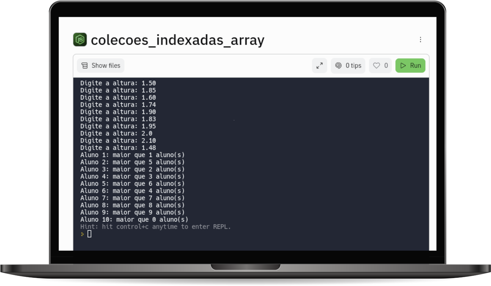

# COLEÇÕES INDEXADAS (ARRAY) 

Faça um algoritmo que receba dez alturas de alunos e, depois, exiba, para cada aluno, o número de alturas menores que a sua.

 ## Objetivos de aprendizagem
 1. Utilizar comandos de repetição aninhados
 2. Utilizar coleções indexadas (array)

## Tecnologias utilizadas  

1. JavaScript 
2. NodeJS

## Projeto em execução

 

[Visualizar Projeto](https://replit.com/@GabrielMorozini/colecoesindexadasarray?v=1)

 

  
  
     

