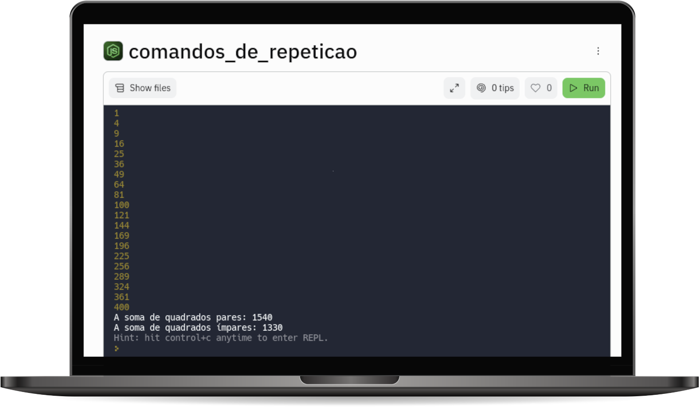

# COMANDOS DE REPETIÇÃO  

Número quadrado, em matemática, é um inteiro que pode ser escrito como o quadrado de outro número inteiro. Ou ainda se a raiz quadrada de um número inteiro for outro inteiro, o primeiro é um número quadrado.

Exemplos de números quadrados: 12 = 1; 22 = 4; 32 = 9; 42 = 16

Faça um algoritmo para mostrar os 20 primeiros números quadrados.

Também informe no final, a soma dos quadrados pares e a soma dos quadrados ímpares.

## Objetivos de aprendizagem
1. Utilizar comandos de repetição
2. Utilizar comandos de decisão 

## Tecnologias utilizadas  

1. JavaScript 
2. NodeJS

## Projeto em execução

 

[Visualizar Projeto](https://replit.com/@GabrielMorozini/comandosderepeticao?v=1)

 

  
  
     

