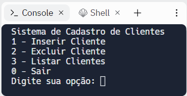
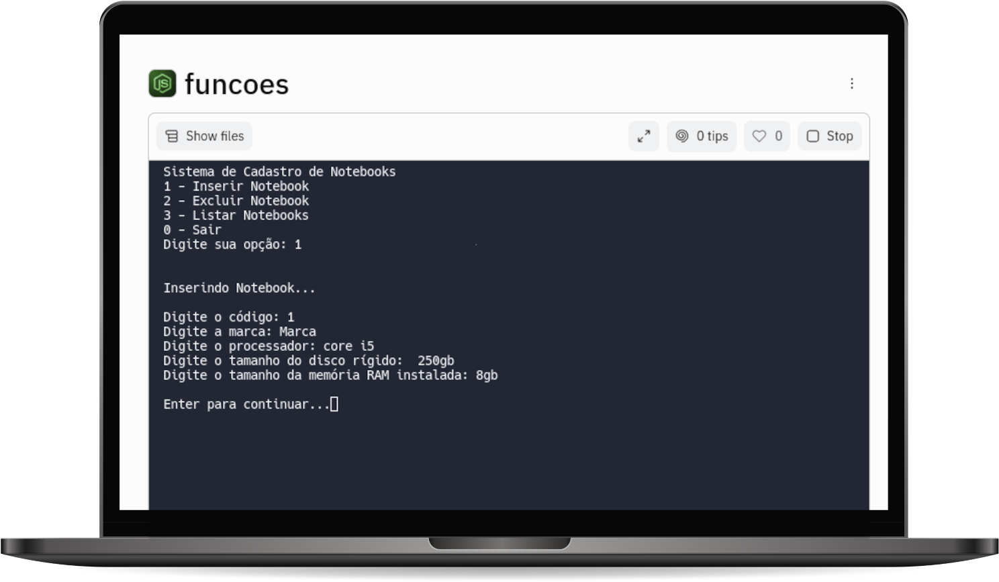

# FUNÇÕES

Nesta prática vamos elaborar um programa que simula um pequeno sistema de cadastros.

O primeiro passo a ser realizado é a escolha do tema, dentre os possíveis temas no recurso de escolha da sala virtual. Após escolher seu tema, você deverá pensar em quatro características relacionadas ao conceito do tema, além do código (um identificador único). Por exemplo, para o tema cliente poderíamos ter as características: código, nome, e-mail, celular e estado.

Seu programa deverá contemplar as funcionalidades de inserção, remoção e listagem.

Todos os cadastros deverão ser armazenados em uma coleção indexada do tipo array.
O sistema deverá apresentar um menu com as seguintes opções, conforme figura a seguir:

Este menu deverá ser exibido até que o usuário do programa digite a opção zero. Para isso, utilize um comando de repetição.

A implementação das opções de inserção (1), exclusão (2) e listagem (3), devem ser realizadas em funções específicas. Os detalhamentos das funções a serem implementadas são:

1.	function inserir: esta função deve receber como parâmetro um objeto relacionado ao tema escolhido. O corpo da função deve apenas adicionar este novo elemento ao array. A função não irá retornar valor.
2.	function excluir: esta função deve receber o código como parâmetro. O corpo da função irá localizar o cadastro com o respectivo código no array e removê-lo. A função não irá retornar valor.
3.	function listar: esta função não deverá receber parâmetro. O corpo da função irá percorrer o array e imprimir todos os cadastros. A função não irá retornar valor.

## Objetivos de aprendizagem
1. Implementar funções

## Tecnologias utilizadas  

1. JavaScript 
2. NodeJS

## Projeto em execução

 

[Visualizar Projeto](https://replit.com/@GabrielMorozini/funcoes?v=1)

 

  
  
     

