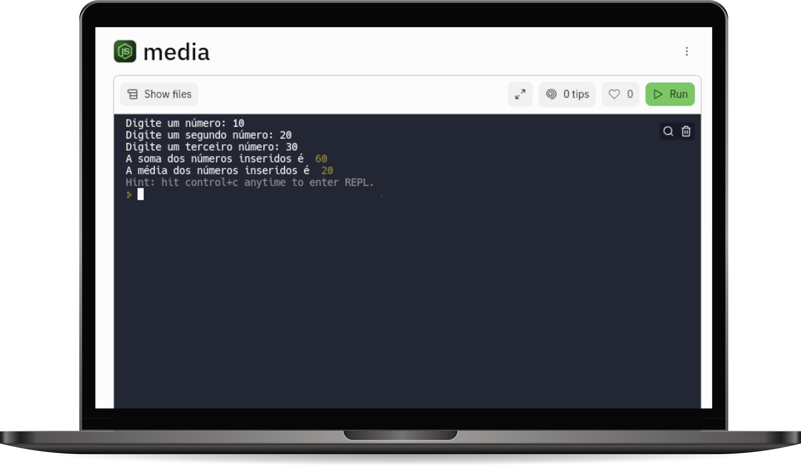

# SOMA E MEDIA 

Elabore um algoritmo que receba três números e ao final imprima na tela, a soma dos três números e a média dos três números.

## Tecnologias utilizadas  

1. JavaScript 
2. NodeJS

## Projeto em execução

 

[Visualizar Projeto](https://replit.com/@GabrielMorozini/somamedia?v=1)

 

  
  
     

